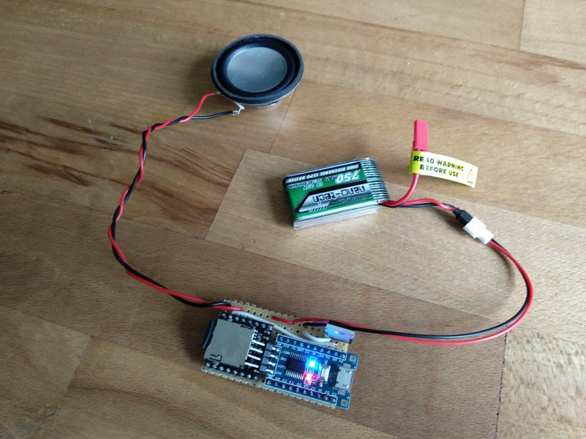
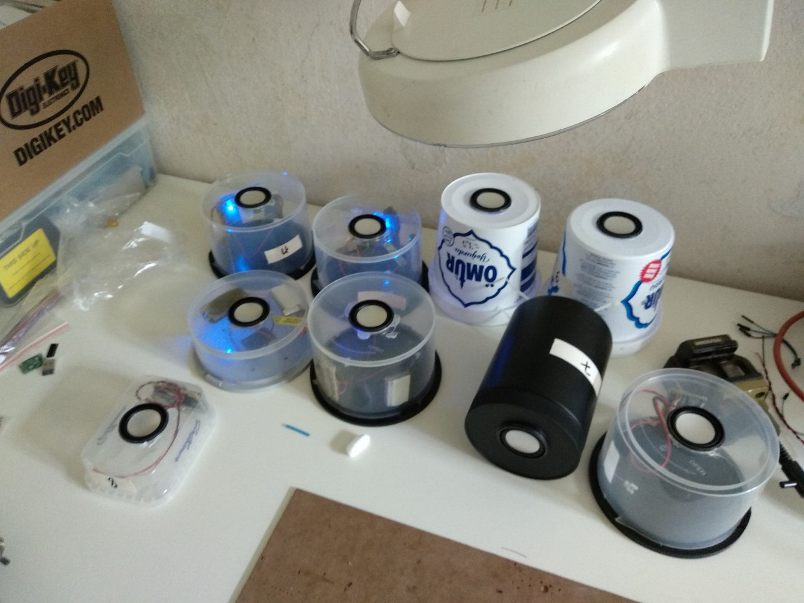

## Quotebox

This piece of electronics was made for an installation where speakers at various places would play short bits of sound at random intervals. Since there was no power available, the speakers need to run off 1S LiPo batteries. Since the budget was quite low, only cheap and easy to source components were used.

### Components
A DFPlayer mini module is used to play mp3 sound bites from an SD card. Since the Idle Power consumption of the DFPlayer is quite high, even when in Standby mode, an external STM8 microcontroller is used to power up the DFPlayer through a MOSFET when needed and power it down as soon as it has finished playing. The STM8 also keeps track of sleep times and which track on the card to play next.

### Energy
750mAh LiPo batteries from HobbyKing were used to power each speaker as I had them laying around from my drone anyway. Both the STM8 and DFPlayer work with 3-5V, so no voltage regulator was needed, keeping the price down. The voltage of the LiPo is not checked by the microcontroller, however, so the circuit will deep-discharge the battery if left unattended for too long. For our use case, the speakers played a sound of ca. 5s every few minutes. The STM8 needs ca. 2mA when in sleep mode (mostly
due to the power LED on the breakout board. If lower consumption is required, one should remove the LED). The DFPlayer consumes 50-120mA when playing a file (depending on the content of the file). All in all, the speakers would have been able to work for 2-3 days on a single LiPo.

### Firmware
The firmware for the STM8 is in the `src` folder. The DFPlayer is addressed over UART via the `dfplayer.c` module, the `awu.c` sends the microcontroller to sleep and the external MOSFET that powers the DFPlayer on and off is switched in the `gpio.c` file, along with the user LED.
The firmware can be built with SDCC using `make all` and uploaded to a board with `make flash`. An STLink (clone) and [stm8flash] are required for this. If you run into problems uploading to a new board, you might try unlocking it using `make unlock`

[stm8flash]: https://github.com/vdudouyt/stm8flash

### Schematics
I tried started doing a custom PCB for the speakers, but ended up opting for Perf Board eventually. Therefore the schematics are only a rough guide.

### Housing

Again, to keep cost low, the speakers were hot-glued into old CD-R spindles to give them some protection and improve the resonance of the speaker

### Summary
The speakers at full volume were loud enough to be heard indoors. The ones installed outdoors (in a rather noisy environment) were quite hard understand from a few meters away already, so a bigger speaker and amp would be required for this to work.
